# NWIS — Nearby Wells Intelligence System

**SIH 2026 · Problem Statement SIH26121 · Oil India Limited**

NWIS is an institutional-memory layer that sits beside a real-time drilling monitor (eRTMAC).
It connects the **active well's current depth** to what **nearby and historical wells** experienced
at that depth and formation, **why** it happened, **what worked**, and **what to check next** —
with every insight traceable to a source document, page, well and depth.

> **Synthetic demo data.** All wells, events, reports and parameters in this repository are
> generated for the prototype and are **not** Oil India Limited operational data. The data model is
> built so authorised OIL data can replace the demo set.

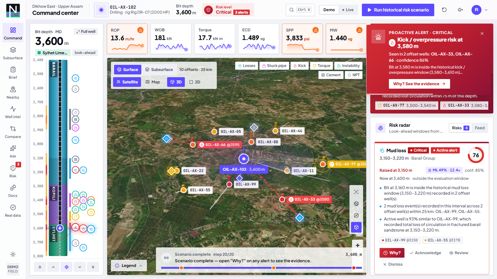

---

## Quick start

Prerequisites: **Python 3.11+** and **Node.js 20+**. No API keys, no internet needed for the core demo
(only the map basemap tiles are fetched online; wells, paths and events still render offline).

**Windows (PowerShell)**

```powershell
.\start.ps1          # creates venv, installs, seeds the demo DB, starts API + UI, opens the browser
```

**macOS / Linux**

```bash
./start.sh
```

**Manual**

```bash
# backend  (http://127.0.0.1:8000, docs at /docs)
cd backend
python -m venv .venv
.venv\Scripts\activate            # macOS/Linux: source .venv/bin/activate
pip install -r requirements.txt
python seed_data.py               # optional — the API auto-seeds an empty database on first start
uvicorn main:app --port 8000

# frontend (http://localhost:3000) — in a second terminal
cd frontend
npm install
npm run dev
```

The frontend proxies `/api/*` to the backend (`NWIS_BACKEND_URL`, default `http://127.0.0.1:8000`), so the UI
also works from another laptop on the same network during a live demo.

Run the backend tests: `cd backend && python -m pytest -q` (10 end-to-end API tests).

---

## The 3-minute demo

Click **Run historical risk scenario** in the top bar. The bit drills 3,100 → 3,600 m in 20 steps
(1.5 s each) and the whole cockpit re-evaluates at every step:

| Depth | What happens | Why (from the engine) |
|---|---|---|
| 3,100 m | Mud-loss **watch** card (medium) | Loss window 50 m ahead; 2 offsets lost returns in the Barail |
| **3,150 m** | **Mud Loss alert — HIGH** (→ critical at 3,160 m) | Inside OIL-AX-99's 3,150–3,220 m loss window; ECD rising above programme towards the offsets' 1.51–1.52 sg loss-onset values |
| **3,380 m** | **Stuck Pipe alert — HIGH** (→ critical at 3,400 m) | OIL-AX-88, OIL-AX-66, OIL-AX-11 stuck in the Kopili; torque 1.3× the rolling baseline |
| 3,500 m | Torque/drag stays a **watch** card | Medium-severity history + no live confirmation → alarm policy suppresses the alert |
| **3,580 m** | **Kick alert — CRITICAL** | OIL-AX-33 kicked at 3,590 m; SPP drop + drilling break; mud weight 1.44 sg is below the 1.52 sg that controlled OIL-AX-33 |

Then click **Why?** on any alert: weighted factor breakdown, live signals vs baseline, the supporting
offset wells with quotes, source citations that open the exact report page, recommended checks, and
the alert's audit trail. **Reset** returns to 3,100 m and clears alerts and uploads.

The full judge script with clicks and talking points is in [docs/DEMO_SCRIPT.md](docs/DEMO_SCRIPT.md);
pitch text is in [docs/PITCH.md](docs/PITCH.md) and a 10-slide deck with speaker notes is
[docs/NWIS_Pitch_Deck.pptx](docs/NWIS_Pitch_Deck.pptx). A recorded backup walkthrough (map → offset profile →
source page → evidence search → scenario → Why? → acknowledge) is at
[docs/nwis-demo-walkthrough.webm](docs/nwis-demo-walkthrough.webm) — plays in any browser.

---

## What maps to the problem statement

| PS requirement | Where in NWIS | Try it |
|---|---|---|
| **P1 / S2** nearby wells on a map, user radius | Field map (Command Center, Nearby Wells): active well, offsets, well paths, bit position, radius 0.5–50 km | Nearby Wells → drag the radius from 25 km to 1.5 km, then 50 km |
| **P2 / S3** instant access to historical experience | Well profile drawer, Well Intelligence, knowledge-base library, source viewer | Click OIL-AX-99 on the map |
| **P3 / S4** correlate across wells by depth & formation | Depth scrubber, Well Intelligence overlay, Correlate & Compare (formation-top correlation + multi-well parameter chart), casing strings, formation porosity / pore pressure / fracture gradient, and an offset-calibrated mud-weight window | Correlate & Compare · Risk Explorer → Mud-weight window |
| **P4 / S6** proactive alerts near risky depths | Depth-aware risk engine, alert toasts, Risk Watch, acknowledge / review / dismiss, audit trail | Run historical risk scenario |
| **S1** AI/NLP/OCR extraction from reports | Document Intelligence: PDF text layer → OCR adapter → chunking → rule-based event/entity extraction → duplicate check → human review → knowledge base | Document Intelligence → Process sample report |
| **S5** predictive risk for losses, stuck pipe, overpressure, torque, cementing | Explainable hybrid risk score over 7 risk families, risk profile along the well path | Risk Explorer |
| **S7** dashboard for field & office | Six-screen dark operations cockpit | — |

---

## Architecture

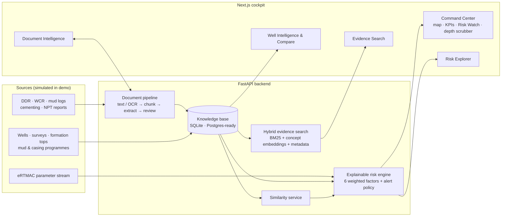

More detail — data model, scoring maths, retrieval, extraction rules and production integration
points — in [docs/ARCHITECTURE.md](docs/ARCHITECTURE.md).

### Risk score (transparent by design)

```
score = 0.30·proximity + 0.20·frequency + 0.10·similarity + 0.10·formation + 0.25·parameter + 0.05·trajectory
severity: ≥0.75 critical · ≥0.55 high · ≥0.35 medium · else low
alert policy: high/critical-history zones alert at ≥0.55; medium/low-history zones only at ≥0.75
```

Every factor, weight and contribution is shown in the **Why?** view and on the Risk Explorer model card.
Scores rank risk; they are not calibrated probabilities.

### Evidence search

Hybrid retrieval over report pages and structured events (`0.40 keyword + 0.35 semantic + 0.25 metadata`),
query understanding for depth / formation / risk family / well / "here", and **extractive, citation-first
answers** — each sentence carries `[n]` citations to evidence cards. When nothing clears the relevance
threshold the answer is *"Insufficient evidence…"*, never a guess. An optional Claude adapter can
synthesise the answer over the same cited evidence when demo mode is off (see below).

---

## Screens

| | |
|---|---|
| 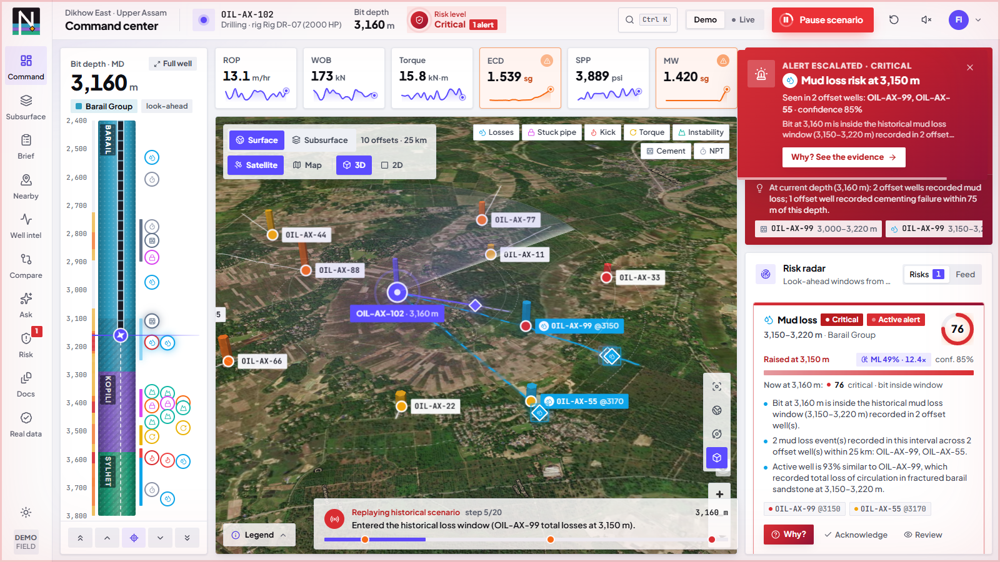 **Proactive alert** at 3,150 m with map highlights | 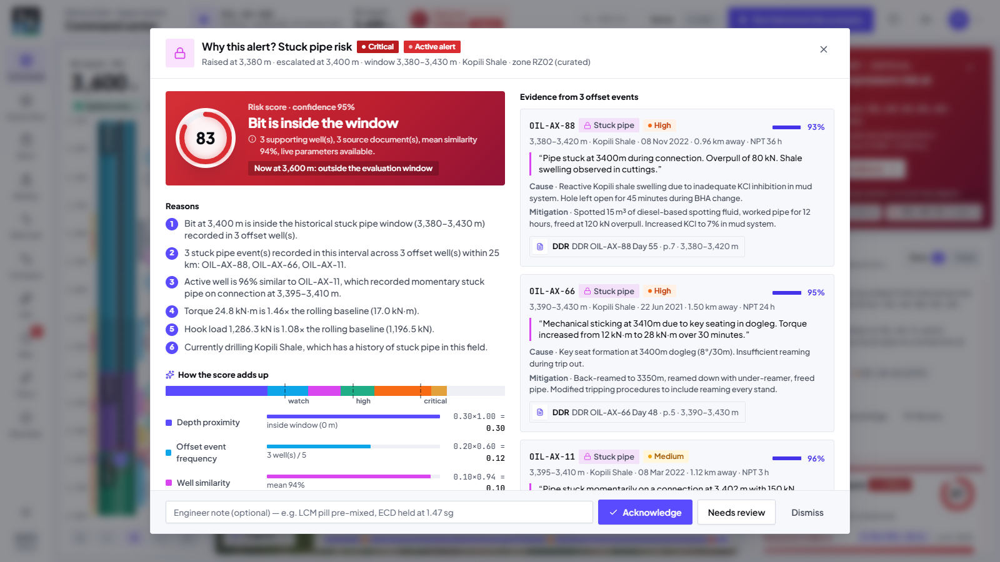 **Why?** — factors, signals, offsets, evidence |
| 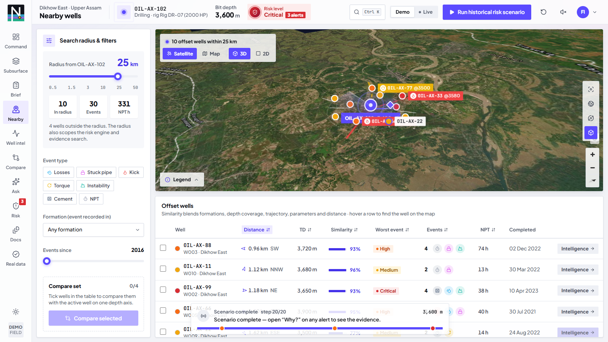 **Nearby Wells** — radius, filters, similarity | 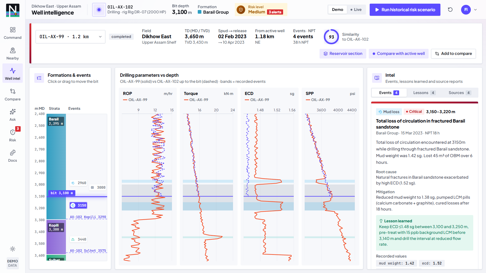 **Well Intelligence** — depth-aligned events & parameters |
| 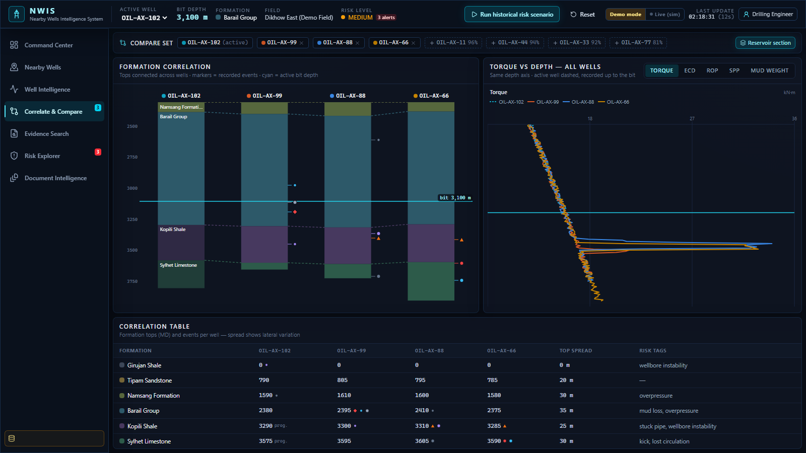 **Correlate & Compare** — formation tops across wells | 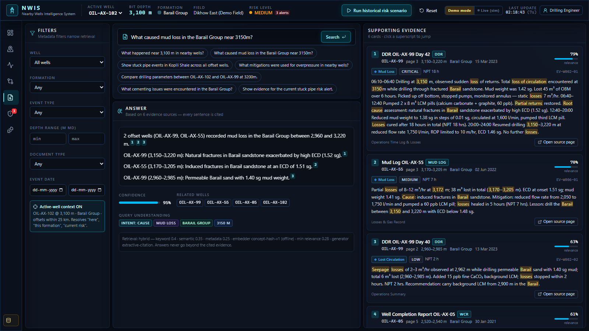 **Evidence Search** — cited answer + evidence cards |
| 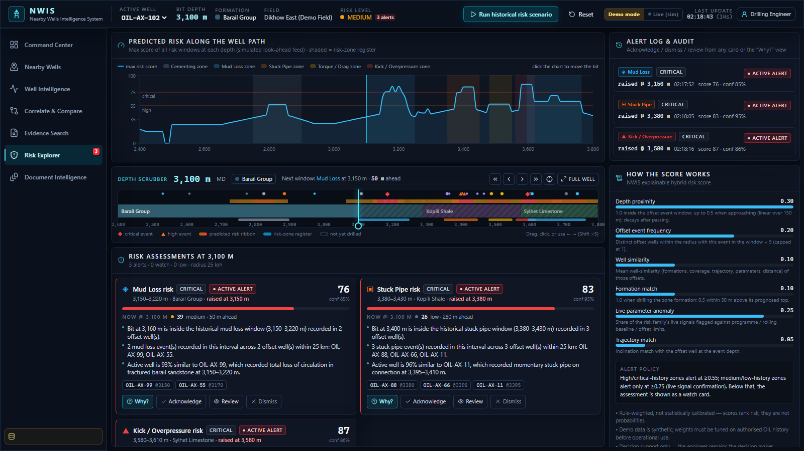 **Risk Explorer** — profile, alert log, model card | 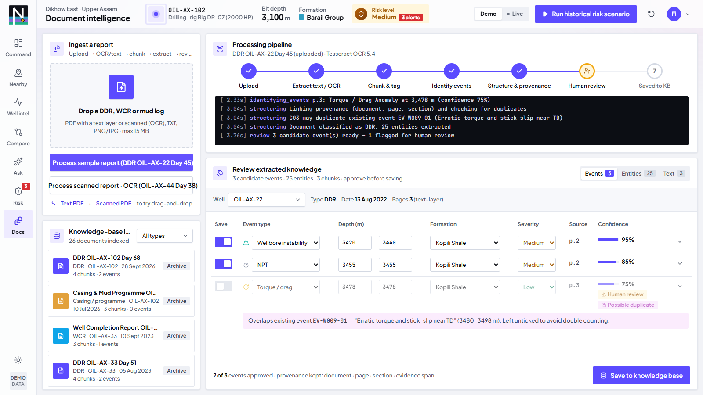 **Document Intelligence** — extraction & human review |
| 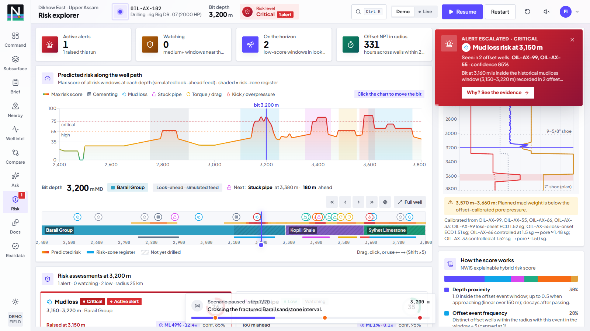 **Mud-weight window** — live ECD meets the offset-calibrated Barail fracture gradient | 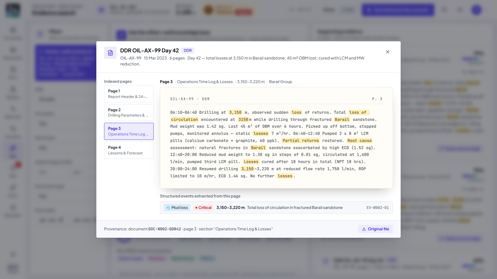 **Source viewer** — every citation opens the report page |

---

## Demo dataset

| Item | Count | Notes |
|---|---|---|
| Wells | 15 | Active OIL-AX-102 + the 10 offsets from the spec (≤2 km) + 4 regional wells at 28–47 km |
| Drilling events | 36 | The 6 mandated seed stories verbatim + 30 corroborating / routine events |
| Documents | 26 | DDR, WCR, mud log, cementing, NPT, casing & mud programme → 84 indexed pages |
| Risk zones | 7 | RZ01–RZ05 exactly as specified + 2 derived by event clustering |
| Parameter samples | ~5,700 | Deterministic per (well, depth); the active well carries precursors ahead of each window |
| Sample upload | 1 PDF | `DDR_OIL-AX-22_Day45_SAMPLE.pdf` — a report *not* yet in the knowledge base |

Regenerate everything with `python backend/seed_data.py`. Report text files are also written to
`backend/data/synthetic_reports/` and ingested through the same parser the upload path uses.

---

## Configuration

| Variable | Default | Purpose |
|---|---|---|
| `NWIS_DATABASE_URL` | `sqlite:///backend/data/nwis.db` | Any SQLAlchemy URL (e.g. PostgreSQL) |
| `NWIS_DEMO_MODE` | `1` | Deterministic, offline; disables the LLM adapter |
| `NWIS_LLM_PROVIDER` | `none` | `anthropic` enables grounded answer synthesis (needs `pip install -r requirements-optional.txt` and Anthropic credentials) |
| `NWIS_LLM_MODEL` | `claude-opus-5` | Model for the optional adapter |
| `NWIS_DOC_STAGE_DELAY` | `0.7` | Seconds per document-pipeline stage (pacing for the live stepper) |
| `NWIS_BACKEND_URL` (frontend) | `http://127.0.0.1:8000` | Where the Next.js proxy sends `/api/*` |

Optional integrations (`backend/requirements-optional.txt`): `anthropic` (LLM answers), `pytesseract` +
Tesseract binary (OCR for scanned pages — without it the pipeline reports scanned pages instead of
dropping them), `psycopg` (PostgreSQL).

---

## Repository layout

```
backend/
  main.py                 FastAPI app (auto-seeds an empty DB, builds the search index)
  models.py · schemas.py  SQLAlchemy models · Pydantic contracts
  seed_data.py            builds the demo knowledge base
  seed/                   field definition, report corpus, parameter generator, sample PDF
  services/               risk_engine · search_engine · document_processor · similarity · nlp · llm (optional)
  routers/                wells · events · formations · risk · search · documents · simulation
  tests/                  test_api.py · test_pressure.py (+ scenario_sweep / search_debug / answer_preview dev tools)
frontend/
  app/dashboard/          6 screens + Correlate & Compare
  components/             map · dashboard · risk · search · well · documents · shared · ui
  lib/                    api client · Zustand store · types (API contract) · utils
docs/                     architecture · demo script · pitch · assumptions · screenshots · deck · video
tools/                    dev tooling: screenshots, demo video, E2E scenario check, deck build
HANDOFF.md                project status & handoff notes (start here when resuming work)
SIH26121_MASTER_BUILD.md  the build specification
```

---

## Known limitations

- Risk weights are hand-set and explainable, not trained; they must be calibrated on authorised OIL history.
- The "semantic" embedding is an offline concept-hash model with domain synonyms — swap in a sentence-embedding
  model behind `EmbeddingProvider` for production.
- Event extraction is rule-based NLP tuned to drilling-report language; unusual phrasing lands in human review.
- OCR requires Tesseract; without it scanned pages are reported, not read.
- Single active well; no authentication or roles beyond a demo label.

## Next three improvements

1. **Connect real sources** — eRTMAC / WITSML stream into the parameter schema, OIL's DDR/WCR archive through
   the document pipeline, PostgreSQL + pgvector for the index.
2. **Calibrate the risk engine** — fit factor weights and alert thresholds on labelled historical NPT events
   (precision/recall per risk family), keeping the same explainable factors.
3. **Close the loop** — capture engineer acknowledgements and outcomes as new lessons, and pre-spud
   "offset review" reports for planned wells.

---

Built for SIH 2026. Decision support only — the drilling engineer remains in control.
