# NWIS — Nearby Wells Intelligence System

**SIH 2026 · Problem Statement SIH26121 · Oil India Limited**

NWIS is an institutional-memory layer that sits beside a real-time drilling monitor (eRTMAC).
It connects the **active well's current depth** to what **nearby and historical wells** experienced
at that depth and formation, **why** it happened, **what worked**, and **what to check next** —
with every insight traceable to a source document, page, well and depth.

> **Demo field, real-data proof.** The Assam field in the cockpit is illustrative — modelled on real Upper Assam
> stratigraphy, **not** Oil India Limited operational data. The *Real data* screen runs the same pipeline on
> **1,970 real public well histories** from the Norwegian Offshore Directorate (NLOD 2.0) — 611 drilling problems
> found, 94 % precision on a hand-checked held-out sample.


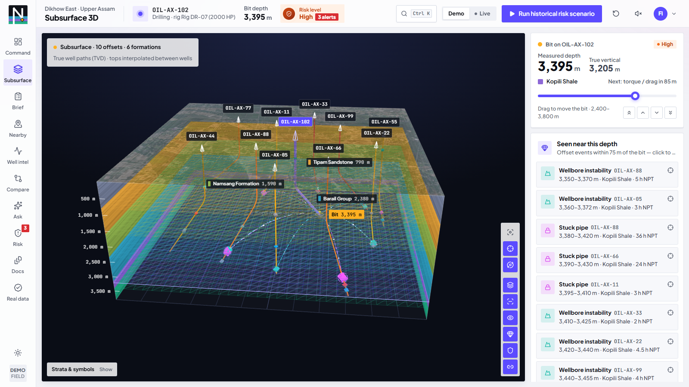

---

## Quick start

Prerequisites: **Python 3.11+** and **Node.js 20+**. No API keys, no internet needed for the core demo
(only the map imagery / terrain tiles are fetched online; wells, paths, towers and events still render offline).
Use a Chromium-based browser with hardware acceleration on — the 3D map is WebGL.

**Windows (PowerShell)**

```powershell
.\start.ps1          # creates venv, installs, seeds the demo DB, starts API + UI, opens the browser
```

**macOS / Linux**

```bash
./start.sh
```

**Manual**

```bash
# backend  (http://127.0.0.1:8000, docs at /docs)
cd backend
python -m venv .venv
.venv\Scripts\activate            # macOS/Linux: source .venv/bin/activate
pip install -r requirements.txt
python seed_data.py               # optional — the API auto-seeds an empty database on first start
uvicorn main:app --port 8000

# frontend (http://localhost:3000) — in a second terminal
cd frontend
npm install
npm run dev
```

The frontend proxies `/api/*` to the backend (`NWIS_BACKEND_URL`, default `http://127.0.0.1:8000`), so the UI
also works from another laptop on the same network during a live demo.

Run the backend tests: `cd backend && python -m pytest -q` (22 API tests).

---

## The 3-minute demo

Open `http://localhost:3000` — the welcome globe spins; pick a role and NWIS dives from orbit into the field.
Then click **Run historical risk scenario** in the top bar. The bit drills 3,100 → 3,600 m in 20 steps
(1.5 s each) and the whole cockpit re-evaluates at every step — alerts arrive as a colour-graded toast with a
screen-edge flash, and the 3D map flies to frame the offset wells behind each alert:

| Depth | What happens | Why (from the engine) |
|---|---|---|
| 3,100 m | Mud-loss **watch** card (medium) | Loss window 50 m ahead; 2 offsets lost returns in the Barail |
| **3,150 m** | **Mud Loss alert — HIGH** (→ critical at 3,160 m) | Inside OIL-AX-99's 3,150–3,220 m loss window; ECD rising above programme towards the offsets' 1.51–1.52 sg loss-onset values |
| **3,380 m** | **Stuck Pipe alert — HIGH** (→ critical at 3,400 m) | OIL-AX-88, OIL-AX-66, OIL-AX-11 stuck in the Kopili; torque 1.3× the rolling baseline |
| 3,500 m | Torque/drag stays a **watch** card | Medium-severity history + no live confirmation → alarm policy suppresses the alert |
| **3,580 m** | **Kick alert — CRITICAL** | OIL-AX-33 kicked at 3,590 m; SPP drop + drilling break; mud weight 1.44 sg is below the 1.52 sg that controlled OIL-AX-33 |

Then click **Why?** on any alert: weighted factor breakdown, live signals vs baseline, the supporting
offset wells with quotes, source citations that open the exact report page, recommended checks, and
the alert's audit trail. **Reset** returns to 3,100 m and clears alerts and uploads.

Two more things to try:

- Flip the Command Center map to **Subsurface** (or open *Subsurface 3D*) before running the scenario: the field
  becomes a cut-away 3D block — strata built from every offset's formation tops, true well paths, events at their
  depth — and each alert flashes the bit's depth plane and flies the camera to the evidence.
- Open **Brief**: the look-ahead brief for the next 150 / 300 / 500 m or to TD — hazard windows, how many offsets
  hit each one, what worked ranked by the NPT it took, the offset-calibrated mud-weight window, a checklist and
  sign-off, and the expected NPT in hours and ₹. Print / PDF, copy as text, or read it aloud.

- Open **Real data**: the same extractor on every public well history on the Norwegian shelf (1,970 histories,
  783k words, ~2–4 s), the offset analysis around the Volve discovery well on real formation tops, mud weights and
  leak-off tests, and the held-out accuracy check with every miss shown.

**Ctrl K** (or `/`) opens a command palette anywhere: screens, wells, depths (`3380`), hazard windows, actions,
or a question for Ask. The speaker icon in the top bar turns on spoken alerts.

The full judge script with clicks and talking points is in [docs/DEMO_SCRIPT.md](docs/DEMO_SCRIPT.md);
pitch text is in [docs/PITCH.md](docs/PITCH.md) and a 13-slide deck with speaker notes is
[docs/NWIS_Pitch_Deck.pptx](docs/NWIS_Pitch_Deck.pptx).

**Demo video (3:01, 1080p):** `docs/video/NWIS_SIH26121_demo.mp4` — Team Huzzards · SIH26121 → problem → game-changer → core innovation →
live walkthrough → impact, narrated in the team's own (cloned) voice, with an original score and captions (`…_captioned.mp4`,
[`.srt`](docs/video/NWIS_SIH26121_demo.srt)). The MP4s are over GitHub's 100 MB file limit, so they are not in the
repo — rebuild them with `tools/video/` (records the live app and edits the film). Voiceover script for a human
narrator: [docs/VIDEO_SCRIPT.md](docs/VIDEO_SCRIPT.md).

---

## What maps to the problem statement

| PS requirement | Where in NWIS | Try it |
|---|---|---|
| **P1 / S2** nearby wells on a map, user radius | 3D field map (Command Center, Nearby Wells): satellite imagery + terrain, active well, offsets, well paths, bit position, history towers, radius 0.5–50 km; **Subsurface 3D** block with true well paths (TVD) and events at depth | Nearby Wells → drag the radius from 25 km to 1.5 km, then 50 km · Subsurface 3D |
| **P2 / S3** instant access to historical experience | Well profile drawer, Well Intelligence, knowledge-base library, source viewer | Click OIL-AX-99 on the map |
| **P3 / S4** correlate across wells by depth & formation | Wellbore navigator, Well Intelligence overlay, Correlate & Compare (geological cross-section with every well's **casing strings and shoes**, multi-well parameter chart, correlation table with porosity / pore pressure / fracture gradient, **mud-weight programme** and casing programme per well), and an offset-calibrated mud-weight window | Correlate & Compare · Risk Explorer → Mud-weight window |
| **P4 / S6** proactive alerts near risky depths | Depth-aware risk engine, alert toasts, Risk Watch, acknowledge / review / dismiss, audit trail, spoken alerts; **Look-ahead brief** for the next N m with what worked, mud-weight window and expected NPT | Run historical risk scenario · Brief |
| **S1** AI/NLP/OCR extraction from reports | Document Intelligence: text-layer PDFs and **scanned PDFs / images via Tesseract OCR** → chunking → rule-based event/entity extraction → duplicate check → human review → knowledge base; **proven on 1,970 real public well histories** (94 % held-out precision) | Document Intelligence → Process sample report · Process scanned report (OCR) · Real data |
| **S5** predictive risk for losses, stuck pipe, overpressure, torque, cementing | Explainable hybrid risk score over 7 risk families, risk profile along the well path, and a **learned cross-check** (logistic model backtested leave-one-well-out on the offsets) | Risk Explorer → How the score works · ML chip on every risk card |
| **S7** dashboard for field & office | Welcome + role select, nine workspaces, Ctrl K command palette, daylight and night-shift themes, 3D satellite field map, printable brief | Welcome → pick *Drilling engineer*, *Office analyst* or *Drilling manager* |

---

## Architecture

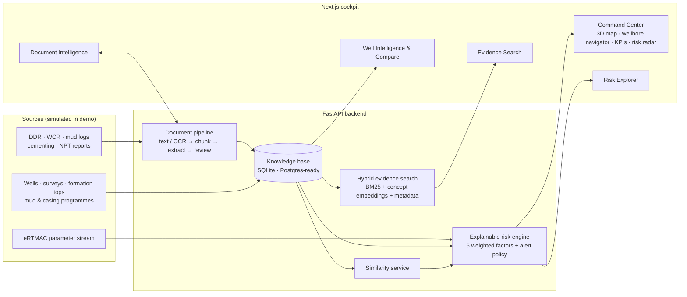

More detail — data model, scoring maths, retrieval, extraction rules and production integration
points — in [docs/ARCHITECTURE.md](docs/ARCHITECTURE.md).

### Risk score (transparent by design)

```
score = 0.30·proximity + 0.20·frequency + 0.10·similarity + 0.10·formation + 0.25·parameter + 0.05·trajectory
severity: ≥0.75 critical · ≥0.55 high · ≥0.35 medium · else low
alert policy: high/critical-history zones alert at ≥0.55; medium/low-history zones only at ≥0.75
```

Every factor, weight and contribution is shown in the **Why?** view and on the Risk Explorer model card.
Scores rank risk; they are not calibrated probabilities.

**Learned cross-check.** Each completed offset well is replayed as if it were being drilled, and a logistic model
learns which of the six factors actually preceded its events (≈1,600 backtest points from 12 wells). Scored
leave-one-well-out it ranks risk better than the hand-set weights (AUC ≈ 0.86 vs 0.76) and shows that live
parameter anomalies matter most. It is shown beside every score (ML chip, *Why?*, Risk Explorer) but never drives
alerts — on synthetic data it demonstrates the calibration method.

### Evidence search

Hybrid retrieval over report pages and structured events (`0.40 keyword + 0.35 semantic + 0.25 metadata`),
query understanding for depth / formation / risk family / well / "here", and **extractive, citation-first
answers** — each sentence carries `[n]` citations to evidence cards. When nothing clears the relevance
threshold the answer is *"Insufficient evidence…"*, never a guess. An optional Claude adapter can
synthesise the answer over the same cited evidence when demo mode is off (see below).

---

## Design

The cockpit is built as a product, not a dashboard template: one depth spine, colour only where it means
something, and motion that explains what changed.

- **Two themes** — *Daylight* (default; projects well in bright rooms) and *Night shift* (dark control-room
  palette). Toggle with the sun/moon in the left rail; the choice is remembered per browser.
- **Vertical wellbore navigator** — depth reads top-to-bottom like a well log: strata column, flowing mud in the
  drill string, a spinning bit you drag down, offset-event pins at their depths and a predicted-risk heat ribbon.
- **Real 3D map** — MapLibre GL with Esri World Imagery, reference labels and AWS terrain (no keys); globe fly-in on
  first visit, radar sweep around the active well, extruded history towers (height = NPT + events, colour = worst
  event), animated evidence links to the offsets that saw this depth, 2D/3D, satellite/street and orbit modes.
- **Subsurface 3D** — three.js cut-away block: strata walls and wireframe formation surfaces interpolated from every
  offset's tops, true well paths (TVD) that "drill" in on load, event gems at depth with halos near the bit, hazard
  sleeves on the active plan, a depth plane that follows the bit, and particles streaming from the offsets' events to
  the bit. Alerts flash the plane and fly the camera to the evidence.
- **Alerts that land** — severity-graded toasts, a screen-edge flash, the camera framing the supporting wells, and a
  *Why?* view whose score bar builds factor by factor; optional spoken callouts.
- **Engineered geometry** — near-square corners (4 px panels, 3 px controls, 2 px tags), flat brand colour instead
  of gradients, no glow; circles only where something is a point (status dots, map pins, gauges).
- **Logo** — an "N" drawn from wells: offset well, deviated path and the active well, whose amber bit sits in the
  Kopili risk band (`frontend/app/icon.svg`, `docs/nwis-logo.png`).
- Typeface *Plus Jakarta Sans* (tabular numerals) + *JetBrains Mono* for IDs; palette tokens in
  `frontend/app/globals.css`; animations with Motion; charts with Recharts on themed CSS variables.

## Screens

| | |
|---|---|
| 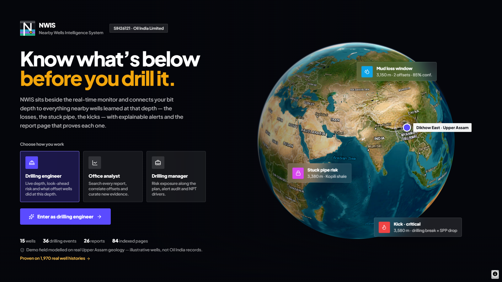 **Welcome** — role select over a live satellite globe | 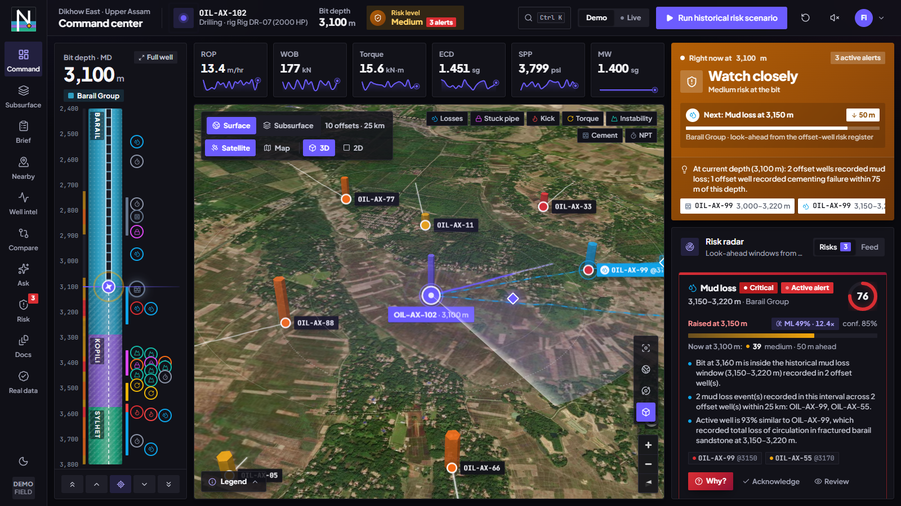 **Night shift** theme |
|  **Proactive alert** at 3,150 m with map highlights |  **Why?** — factors, signals, offsets, evidence |
|  **Nearby Wells** — radius, filters, similarity |  **Well Intelligence** — depth-aligned events & parameters |
|  **Correlate & Compare** — formation tops across wells |  **Evidence Search** — cited answer + evidence cards |
|  **Risk Explorer** — profile, alert log, model card |  **Document Intelligence** — extraction & human review |
|  **Mud-weight window** — live ECD meets the offset-calibrated Barail fracture gradient |  **Source viewer** — every citation opens the report page |
| 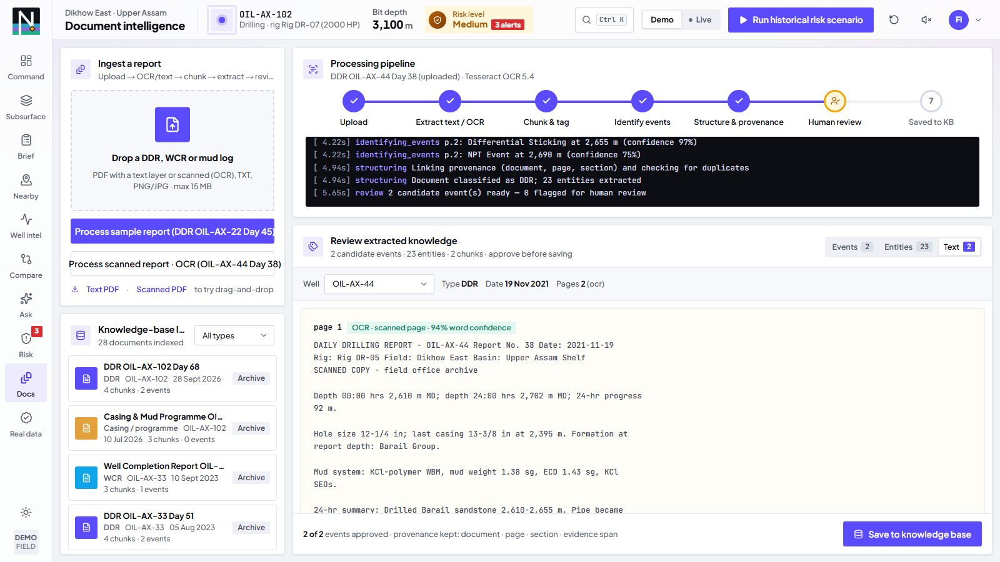 **Scanned report** — an image-only PDF read by Tesseract OCR | 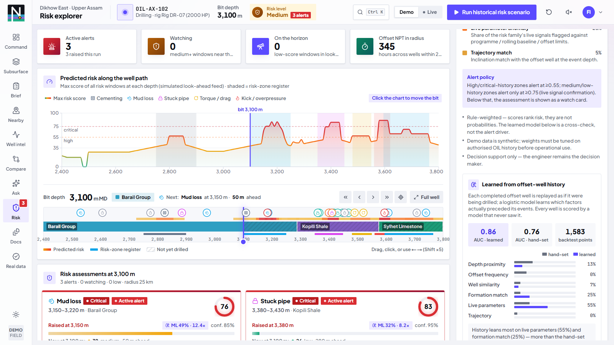 **Learned cross-check** — backtested weights vs hand-set |
|  **Subsurface 3D** — strata, true well paths, events at depth, the bit's plane | 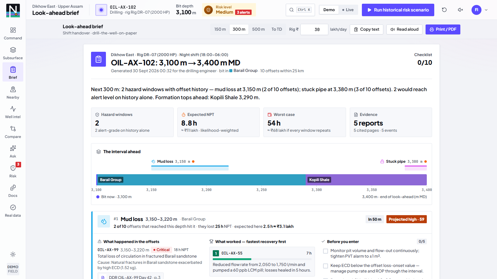 **Look-ahead brief** — next 300 m for the shift handover |
| 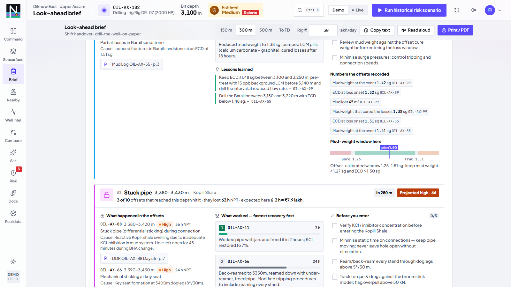 **Brief hazard card** — what happened, what worked, checks, mud window | 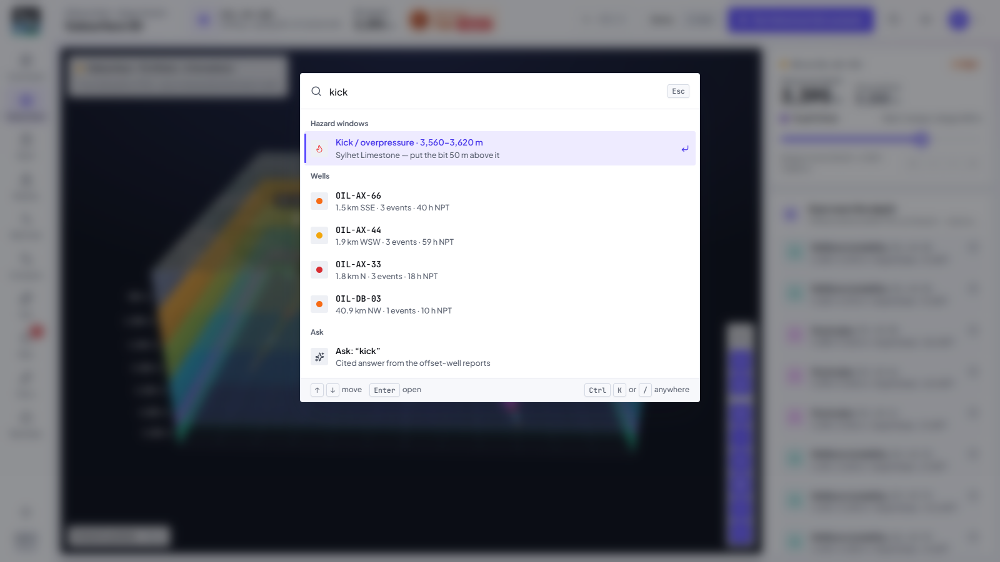 **Command palette** — Ctrl K to any well, depth or hazard |
| 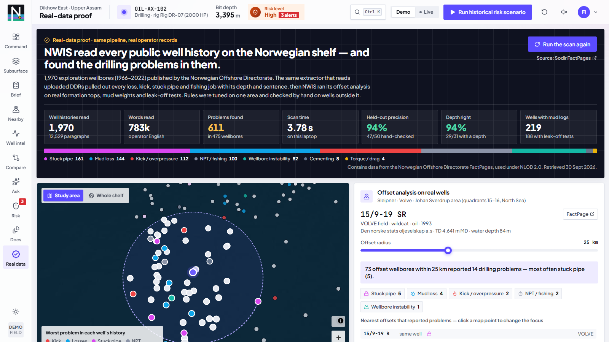 **Real-data proof** — 1,970 public well histories, the shelf map, offsets around Volve | 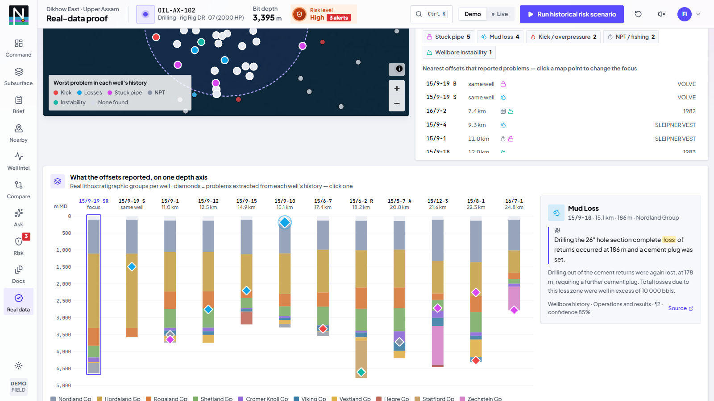 **Real offsets on one depth axis** — real groups + extracted problems |

---

## Demo dataset

| Item | Count | Notes |
|---|---|---|
| Wells | 15 | Active OIL-AX-102 + the 10 offsets from the spec (≤2 km) + 4 regional wells at 28–47 km |
| Drilling events | 36 | The 6 mandated seed stories verbatim + 30 corroborating / routine events |
| Documents | 26 | DDR, WCR, mud log, cementing, NPT, casing & mud programme → 84 indexed pages |
| Risk zones | 7 | RZ01–RZ05 exactly as specified + 2 derived by event clustering |
| Parameter samples | ~5,700 | Deterministic per (well, depth); the active well carries precursors ahead of each window |
| Sample upload | 1 PDF | `DDR_OIL-AX-22_Day45_SAMPLE.pdf` — a report *not* yet in the knowledge base |

Regenerate everything with `python backend/seed_data.py`. Report text files are also written to
`backend/data/synthetic_reports/` and ingested through the same parser the upload path uses.

---

## Configuration

| Variable | Default | Purpose |
|---|---|---|
| `NWIS_DATABASE_URL` | `sqlite:///backend/data/nwis.db` | Any SQLAlchemy URL (e.g. PostgreSQL) |
| `NWIS_DEMO_MODE` | `1` | Deterministic, offline; disables the LLM adapter |
| `NWIS_LLM_PROVIDER` | `none` | `anthropic` enables grounded answer synthesis (needs `pip install -r requirements-optional.txt` and Anthropic credentials) |
| `NWIS_LLM_MODEL` | `claude-opus-5` | Model for the optional adapter |
| `NWIS_DOC_STAGE_DELAY` | `0.7` | Seconds per document-pipeline stage (pacing for the live stepper) |
| `NWIS_BACKEND_URL` (frontend) | `http://127.0.0.1:8000` | Where the Next.js proxy sends `/api/*` |
| `NWIS_TESSERACT_CMD` | auto-detected | Path to `tesseract` if it is not on PATH or in its default install folder |

Optional integrations (`backend/requirements-optional.txt`): `anthropic` (LLM answers), `pytesseract` +
Tesseract binary (OCR for scanned pages — without it the pipeline reports scanned pages instead of
dropping them), `psycopg` (PostgreSQL).

---

## Repository layout

```
backend/
  main.py                 FastAPI app (auto-seeds an empty DB, builds the search index)
  models.py · schemas.py  SQLAlchemy models · Pydantic contracts
  seed_data.py            builds the demo knowledge base
  seed/                   field definition, report corpus, parameter generator, sample PDF
  services/               risk_engine · briefing · search_engine · document_processor · similarity · nlp · llm (optional)
  routers/                wells · events · formations · risk · search · documents · simulation
  opendata/               Sodir FactPages importer (python -m opendata.sodir) · spotcheck.json (held-out labels)
  tests/                  test_api · test_intelligence · test_pressure · test_brief · test_opendata (+ scenario_sweep / requirements_check)
frontend/
  app/dashboard/          Command · Subsurface · Brief · Nearby · Well intel · Compare · Ask · Risk · Docs
  components/             map · subsurface (three.js) · brief · dashboard · risk · search · well · documents · layout · ui
  lib/                    api client · Zustand store · types (API contract) · utils
docs/                     architecture · demo script · pitch · assumptions · screenshots · deck · video
tools/                    dev tooling: screenshots, demo video, E2E scenario check, deck build
HANDOFF.md                project status & handoff notes (start here when resuming work)
SIH26121_MASTER_BUILD.md  the build specification
```

---

## Known limitations

- Alerts use hand-set, explainable weights; the learned cross-check is trained on the synthetic demo field — both must be recalibrated on authorised OIL history.
- The "semantic" embedding is an offline concept-hash model with domain synonyms — swap in a sentence-embedding
  model behind `EmbeddingProvider` for production.
- Event extraction is rule-based NLP tuned to drilling-report language; unusual phrasing lands in human review.
- OCR needs the Tesseract binary (`winget install UB-Mannheim.TesseractOCR` · `brew install tesseract` · `apt install tesseract-ocr`); without it scanned pages are flagged, not read.
- Single active well; no authentication — the role only picks the landing screen and label.

## Next three improvements

1. **Connect real sources** — eRTMAC / WITSML stream into the parameter schema, OIL's DDR/WCR archive through
   the document pipeline, PostgreSQL + pgvector for the index.
2. **Calibrate the risk engine** — fit factor weights and alert thresholds on labelled historical NPT events
   (precision/recall per risk family), keeping the same explainable factors.
3. **Close the loop** — capture engineer acknowledgements and outcomes as new lessons, and pre-spud
   "offset review" reports for planned wells.

---

Built for SIH 2026. Decision support only — the drilling engineer remains in control.
