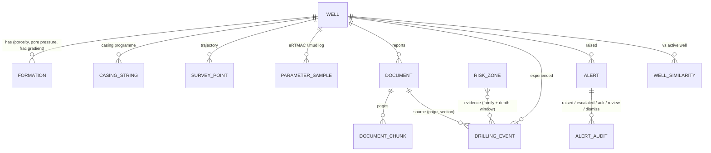

# NWIS architecture

## 1. Components

| Layer | Technology | Responsibility |
|---|---|---|
| UI | Next.js 16 (App Router), React 19, Tailwind 4, MapLibre GL 6, three.js, Motion, Recharts 3, Zustand | Welcome + nine workspaces in two themes (incl. Subsurface 3D and the Look-ahead brief), Ctrl K palette, spoken alerts; one global store holds bit depth, radius, latest evaluation, alerts, scenario state |
| API | FastAPI, Pydantic v2 | REST contract (`/api/wells`, `/events`, `/formations`, `/risk`, `/search`, `/documents`, `/simulation`) — OpenAPI at `/docs` |
| Persistence | SQLAlchemy 2 → SQLite (demo) / PostgreSQL | Knowledge schema (below); list fields use portable JSON columns |
| Intelligence | Pure-Python services | Risk engine, hybrid retrieval, document pipeline, similarity, drilling NLP |
| Optional | Anthropic SDK, Tesseract | Grounded LLM answer synthesis; OCR of scanned pages |

The frontend never talks to the backend cross-origin: Next.js rewrites `/api/*` to the FastAPI server.

## 2. Knowledge schema

Every `DrillingEvent` carries `source_document_id`, `source_page`, `source_section`, depth interval, formation
and date — the provenance the UI shows on every card. `event_params` stores numeric context recorded at the
event (e.g. loss-onset ECD, post-kick mud weight) which the risk engine uses as **offset-referenced limits**.
`Well.mud_program` stores the planned mud weight per formation (baseline for MW/ECD deviation).

## 3. Risk engine (`backend/services/risk_engine.py`)

For each risk zone with offset evidence inside the radius:

1. **Supporting events** = offset events of the zone's risk family overlapping the zone ±30 m.
2. **Factors** (all in [0, 1]):
   - *proximity* — 1.0 inside the offset event window; approaching: `0.5·(1 − gap/150 m)`; passed: `0.5·(1 − gap/100 m)`.
   - *frequency* — distinct supporting wells ÷ 5.
   - *similarity* — mean well-similarity of those wells to the active well.
   - *formation* — 1.0 in the zone formation, 0.5 within 50 m above its prognosed top.
   - *parameter* — share of the family's live signals flagged. Signals: MW/ECD vs the mud programme
     (absolute gates 0.015 / 0.02 sg) and vs offset limits (loss-onset ECD − 0.03; post-kick MW − 0.02);
     torque, hook load, SPP, ROP, RPM vs a detrended rolling baseline (window d−250…d−60 m, ratio gate + |z| ≥ 2).
   - *trajectory* — `1 − |Δinclination|/20°` at each event depth.
3. **Score** `= 0.30·prox + 0.20·freq + 0.10·sim + 0.10·form + 0.25·param + 0.05·traj`.
4. **Severity** by thresholds 0.35 / 0.55 / 0.75. **Alert policy**: zones with high/critical history alert at
   ≥ 0.55; medium/low history only at ≥ 0.75 (needs live confirmation) — an alarm-rationalisation choice so
   the engineer is not flooded.
5. **Alerts** are persisted once per zone, escalated (with an audit entry) when severity rises, and keep a
   full snapshot of the assessment at trigger time for the "Why?" view.
6. **Confidence** `= 0.35 + 0.30·min(1, wells/3) + 0.10·min(1, docs/3) + 0.15·similarity + 0.10·[live params]`, capped 0.95.

`GET /api/risk/profile` scores every 10 m of the planned path (drives the wellbore / depth-ruler risk ribbon and the Risk
Explorer chart); `GET /api/risk/clusters` groups recurring offset events and lists what worked.

Specification deviation (documented in [ASSUMPTIONS.md](ASSUMPTIONS.md)): the spec's default weights and
zone-centre proximity could not separate "approaching" from "inside" for the seeded scenario, so proximity is
measured to the offset *event* window and live parameters carry more weight (0.25 vs 0.10).

### Mud-weight window (`backend/services/pressure.py`)

`GET /api/wells/{id}/pressure-window` returns, every 10 m, the prognosed pore pressure and fracture gradient (from
`Formation.pore_pressure_sg / frac_gradient_sg`), the same lines **calibrated by offset events** — loss events cap the
fracture gradient at their recorded loss-onset ECD, kick/overpressure events raise pore pressure to 0.02 sg below
the mud weight that controlled them (25 m tapers) — plus the planned mud weight, the live ECD, casing shoes, and
"breaches" where the plan leaves the calibrated window (e.g. planned 1.44 sg in the Sylhet vs ~1.50 sg calibrated
pore pressure). Every calibration lists its source well and event.

### Learned cross-check (`backend/services/risk_model.py`)

The hand-set score drives alerts; a learned model checks it against history:

1. **Backtest dataset** — every completed offset well is replayed as if it were being drilled. At every 20 m from
   2,000 m to TD the engine assesses it exactly as it assesses the active well (evidence = the *other* wells only,
   the well's own recorded parameters as the live feed). Label = 1 if that well itself recorded the risk family
   within the next 50 m (or at the bit). ≈1,600 rows from 12 wells, ≈4 % positive.
2. **Model** — L2-regularised logistic regression on the same six factors, fitted by Newton/IRLS in pure Python
   (no numpy/scikit-learn; trains in ~2 s at API start-up, retrains in the background after the knowledge base
   changes).
3. **Validation** — leave-one-well-out: each well is scored by a model that never saw it. On the demo field the
   learned model reaches AUC ≈ 0.86 vs ≈ 0.76 for the hand-set score, and learns that live parameter anomalies
   and the formation matter more (≈55 % / 25 %) than the hand-set weights assume.
4. **Use** — every assessment carries `ml = {probability, base_rate, lift, verdict}`; the UI shows it as a chip on
   risk cards, a cross-check section in *Why?*, and learned-vs-hand-set weights on the Risk Explorer model card.
   It never changes scores or alert decisions (`tests.scenario_sweep` is unaffected). `GET /api/risk/model →
   learned` returns the coefficients, AUCs and per-family results. On synthetic data it proves the method; the same
   pipeline recalibrates on authorised OIL history.

### Look-ahead brief (`backend/services/briefing.py`, `GET /api/risk/brief`)

For every risk zone whose offset envelope overlaps `[depth, depth + horizon]` (and is not already passed):

- **projected** — `assess_zone` with the bit at the window top and **no parameters** (live factor = 0): what the
  history alone says before any live confirmation; **now** — the same zone scored at the current depth with the
  live reading;
- **likelihood** = offsets that hit the window ÷ offsets drilled to its top; **expected NPT** = likelihood × mean
  NPT per affected offset; **worst** = the largest per-offset NPT;
- **what worked** — the evidence events' mitigations ranked by the NPT they took; lessons; `event_params` stated as
  numbers ("ECD at loss onset 1.51 sg — OIL-AX-55");
- **mud window** — max offset-calibrated pore / min frac gradient over the window (from `pressure.py`) → minimum
  MW and ECD limit; programme breaches that overlap it;
- formations and casing shoes in the interval, the distinct cited source pages, and a one-line headline.

It is a pure read: no alerts are recorded. The Brief screen prices NPT at an editable spread rate (₹ lakh/day).

### Real-data proof (`backend/opendata/sodir.py`, `backend/services/opendata.py`, `/api/opendata/*`)

- **Import** (`python -m opendata.sodir [--refresh]`): five FactPages CSV tables (wellbore histories, exploration
  wellbores, formation tops, mud weights, casing & leak-off tests) → `data/opendata/sodir_shelf.json.gz` (every
  history + position) and `data/opendata/sodir_area.json` (the Sleipner–Volve–Johan Sverdrup study area with tops,
  mud, casing/LOT and history paragraphs). The raw cache is git-ignored; the two bundles are committed (offline demo).
- **Extraction**: each history paragraph → `parse_text` (drops TVD/feet conversions and export-mangled volumes so
  MD is the only depth) → `extract_events(narrative=True)`; the formation comes from that well's real tops at the
  event depth (or a unit named in the sentence). *Testing* sections are skipped (flow is intentional there).
- **Offset analysis**: `offsets(name, radius)` = offsets by haversine distance, their events on MD, a 250 m
  profile, their mud weights and leak-off tests; the UI draws the common window per 500 m (heaviest mud needed →
  weakest leak-off).
- **Accuracy**: `spotcheck()` joins `opendata/spotcheck.json` (50 held-out labels keyed by sha1(well|sentence))
  with the current extraction; `test_opendata.py` fails if any label no longer matches.

## 4. Evidence search (`backend/services/search_engine.py`)

- **Units**: report pages (chunks) and structured events. An event hit is displayed as its source page with the
  event attached, so the excerpt is always verbatim report text.
- **Query understanding** (`services/nlp.py`): depth ranges ("near 3400", "3,150–3,220 m"), formations, risk
  families via a drilling synonym lexicon ("lost returns" ≈ mud loss), well names, intent (summary / cause /
  mitigation / list / compare / risk-evidence) and references to the active context ("here", "this formation").
- **Ranking**: `0.40·BM25/ max(BM25, 9) + 0.35·cosine(concept-hash embedding) + 0.25·metadata` (+0.04 for
  structured events). Queries without any drilling cue must also clear cosine ≥ 0.20; results below 0.28
  relevance are dropped.
- **Answering**: sentences are composed only from the retrieved evidence (event descriptions, causes,
  mitigations, lessons), ordered by severity, each with `[n]` citations. Special intents: parameter comparison
  (reads the parameter database for each named well at the depth) and "evidence for the current risk" (runs the
  risk engine at the context depth). No evidence → an explicit insufficient-evidence answer.
- **Optional LLM** (`services/llm.py`): when enabled, Claude receives only the numbered evidence and must cite it;
  outputs without valid citations are discarded and the extractive answer is kept.

## 5. Document pipeline (`backend/services/document_processor.py`)

`upload → text layer (pypdf) or OCR adapter → chunking (≤220 words, 40 overlap) + tagging (depth, formation,
concepts) → sentence-level event extraction → structuring (well, date, type, entities, duplicate check) →
human review → commit`.

- Event patterns per type (losses, sticking, kicks/overpressure, torque, instability, cementing, fishing, NPT);
  a candidate groups the trigger sentence with following cause / mitigation / NPT sentences until a new time-log
  entry or report boundary.
- Severity rules (e.g. SIDPP / pit gain → critical; stuck / twist-off / overpull ≥300 kN → high).
- Confidence from evidence completeness; < 0.75 is flagged for human review.
- Within-document merge (summary + time log describe one event) and cross-KB duplicate detection (same well,
  family, overlapping depth).
- Nothing is written to the knowledge base until the reviewer saves; the index and risk cache rebuild on commit.
- **OCR** — pages with no text layer are OCR'd: the raster images embedded in a scanned PDF page (pypdf, no
  Poppler) or an uploaded image go through Tesseract (`pytesseract`); each page records the engine and mean word
  confidence. The binary is found on PATH, via `NWIS_TESSERACT_CMD`, or in its default install folders. Without it,
  scanned pages are flagged for OCR rather than dropped. Sample: `DDR_OIL-AX-44_Day38_SCANNED.pdf` (image-only,
  rendered by `seed/make_scanned_sample.py`) — OCR ≈ 93 % word confidence, differential sticking at 2,655 m extracted.

## 6. Frontend state flow

`WellboreNavigator / DepthScrubber / scenario / live ticker → store.setDepth → debounced POST /api/risk/evaluate → store.evaluation`
→ KPI strip, map highlights, Risk Watch, timeline context and toasts all render from the same evaluation, so
every panel is always consistent with one depth. The scenario runner lives in the store, so it keeps running
while you switch screens.

**Subsurface 3D** (`components/subsurface/`, three.js, client-only): built once from `/wells/trajectories` (MD, TVD,
lat/lon → local km, depth ×0.6), `/formations/correlate` for the wells within 5 km (tops → IDW-interpolated
surfaces on a 32×32 grid), store events and risk zones. Strata walls use outward-wound faces drawn `BackSide`, so
only the far walls render from any orbit angle (a cut-away "tank"). The frame loop reads the store directly
(`useNWIS.getState()`): the bit glides to `depth`, context events come from `evaluation.context.nearby_events`,
and a newer toast flashes the depth plane and flies the camera to the alert's evidence. Labels are CSS2D DOM
elements; picking is a raycast (well → profile drawer, event → source page).

## 7. Production integration points

| Demo component | Production replacement |
|---|---|
| `seed/parameters.py` samples + `/api/simulation/ertmac` | eRTMAC / WITSML stream writing `ParameterSample` rows (same schema) |
| Synthetic report corpus | OIL DDR/WCR archive through `/api/documents/upload` (batch ingest) |
| SQLite | PostgreSQL (`NWIS_DATABASE_URL`), pgvector for embeddings |
| `ConceptHashEmbedder` | Sentence-embedding model behind `EmbeddingProvider` |
| Extractive answers | `NWIS_LLM_PROVIDER=anthropic` (grounded, citation-validated) |
| OCR adapter (reports scanned pages) | Tesseract / cloud OCR via `OCRAdapter` |
| Hand-set weights | Weights fitted on labelled OIL NPT history (same factors, same explanations) |
| Demo role label | SSO + role-based views (field engineer / office analyst / manager) |
